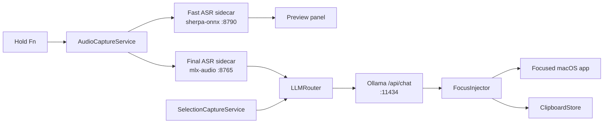

# MLX VoiceOps

English | [中文](README.zh.md)


MLX VoiceOps is a local-first macOS menu bar app for voice-driven writing and translation. Hold the activation key, speak, watch a low-latency preview, and release to run a final ASR pass plus an offline LLM rewrite before the result is inserted back into the focused app.

The project is built around Apple Silicon local inference: a SwiftUI/AppKit macOS app, FastAPI sidecars for speech recognition, and Ollama for offline text processing.

## What it does

- Hold-to-talk input: hold `Fn` by default to start recording, release to finish and inject the result.
- Streaming preview: a fast sherpa-onnx sidecar receives short PCM chunks and updates the floating preview while you speak.
- Final transcription: a mlx-audio sidecar runs the final WAV transcription on release.
- Offline LLM processing: Ollama `/api/chat` translates or polishes the final text with editable prompt templates.
- Selection translation: trigger a shortcut to capture selected text and translate it in a dedicated panel.
- Clipboard history: records clipboard items and VoiceOps outputs for quick reuse.
- Local sidecar lifecycle: the app can launch sidecars automatically when their virtual environments are ready.
- Focus-safe insertion: the preview does not become key, and final injection is skipped when focus moved away during recording.

By default, the built-in prompt profile translates spoken English into natural Chinese. You can change the voice and selection prompt templates in Preferences.

## Requirements

- macOS 13.0 or later
- Apple Silicon Mac recommended for MLX-based ASR
- Xcode for building the macOS app
- Python 3.9+ for sidecars
- Ollama for offline LLM processing
- `xcodegen` only if you edit `apps/macos/project.yml`

Model/runtime expectations:

- Final ASR defaults to `mlx-community/GLM-ASR-Nano-2512-8bit` through `ASR_MODEL_ID`.
- `sidecars/asr_mlx/server.py` runs offline; the installer downloads the selected model into the local Hugging Face cache first.
- Fast ASR expects sherpa-onnx transducer files under `models/zipformer` unless `FAST_ASR_MODEL_DIR` is set.
- Ollama defaults to `qwen2.5-coder:7b-instruct-q5_1`.

## One-command install

Install [Ollama for macOS](https://ollama.com/download/mac) first. Then clone the repository and run the installer:


```bash
git clone https://github.com/xiaokhkh/mlx-voiceops.git
cd mlx-voiceops
./scripts/install.sh
```

The installer is safe to rerun. It:

- creates and updates both Python virtual environments;
- downloads the compact bilingual streaming model and the final MLX ASR model;
- starts Ollama when needed and pulls the default local LLM;
- builds the Release app and installs it to `~/Applications/VoiceOps.app`;
- records the checkout's sidecar path so the installed app can launch its local services;
- launches VoiceOps and opens Preferences on the first run.

The first install downloads several gigabytes of local models. No administrator password is required. Useful options:

```text
--skip-models       Keep existing ASR models and skip downloads
--skip-ollama       Skip the Ollama check and model pull
--no-launch         Install without opening the app
--install-dir PATH  Choose a different per-user app directory
--python PATH       Choose the Python 3.9+ executable
```

Check the entire installation at any time without changing it:

```bash
./scripts/doctor.sh
```

On the first launch, Preferences opens to the setup checklist. Use each permission button once for Microphone, Accessibility, and Input Monitoring. You can reopen it later with `Command + Option + P`, even when the menu bar item is hidden.

The app only reads permission status at launch and never loops automatic requests. A stable local signing requirement, `com.voiceops.VoiceOps`, lets macOS recognize rebuilds at the same path as the same app. The Permissions panel also reports whether both sidecar environments and the streaming model are ready, with direct access to local logs.

## Usage

- Hold `Fn`: record voice, show the floating preview, then process and insert the final result on release.
- Clipboard history shortcut: configurable, default `Command + Fn`.
- Selection translation shortcut: configurable in Preferences.
- Preferences: update activation keys, permissions, and LLM prompt templates.

The app inserts text with paste first and falls back to simulated typing. Accessibility permission is required for reliable injection.

## Architecture



Core pieces:

- `apps/macos/VoiceOps/AppMain.swift`: menu bar app startup, shortcuts, preferences, panels, and sidecar launcher.
- `apps/macos/VoiceOps/Services/FnSessionController.swift`: hold-to-talk session orchestration.
- `apps/macos/VoiceOps/Services/AudioCaptureService.swift`: microphone capture and WAV/PCM chunking.
- `apps/macos/VoiceOps/Services/FastASRClient.swift`: streaming preview client for the fast ASR sidecar.
- `apps/macos/VoiceOps/Services/ASRClient.swift`: final ASR client for the MLX sidecar.
- `apps/macos/VoiceOps/Services/OfflineLLMClient.swift`: Ollama chat client and prompt templates.
- `apps/macos/VoiceOps/Services/FocusInjector.swift`: focus-aware text injection.
- `apps/macos/VoiceOps/Clipboard/`: clipboard history models, storage, and UI.

## Sidecars and local endpoints

| Component | Default port | Endpoint | Purpose |
| --- | ---: | --- | --- |
| Final ASR | `8765` | `GET /health` | Readiness check used by the installer doctor |
| Final ASR | `8765` | `POST /v1/asr/transcribe` | Multipart WAV to final text |
| Fast ASR | `8790` | `POST /v1/fast_asr/start` | Create streaming session |
| Fast ASR | `8790` | `POST /v1/fast_asr/push` | Push base64 float32 PCM chunks |
| Fast ASR | `8790` | `POST /v1/fast_asr/end` | Close streaming session |
| Ollama | `11434` | `POST /api/chat` | Offline translation or polishing |

Sidecar logs are written to `~/Library/Logs/VoiceOps/sidecar_*.log` when launched by the app.

## Configuration

| Variable | Used by | Default | Notes |
| --- | --- | --- | --- |
| `ASR_MODEL_ID` | `asr_mlx` | `mlx-community/GLM-ASR-Nano-2512-8bit` | MLX final ASR model id |
| `FAST_ASR_MODEL_DIR` | `fast_asr` | `models/zipformer` | Directory containing `encoder.onnx`, `decoder.onnx`, `joiner.onnx`, `tokens.txt` |
| `FAST_ASR_SAMPLE_RATE` | `fast_asr` | `16000` | Incoming PCM sample rate |
| `FAST_ASR_NUM_THREADS` | `fast_asr` | `4` | sherpa-onnx decode threads |
| `VOICEOPS_SIDECAR_ROOT` | macOS app | auto-discovered `sidecars` | Override sidecar directory |
| `VOICEOPS_PYTHON_PATH` | macOS app | sidecar `.venv`, then `/usr/bin/python3` | Override Python executable for launched sidecars |

Prompt templates are stored in macOS user defaults and can be edited from Preferences.

## Repository layout

```text
apps/macos/VoiceOps/          macOS SwiftUI/AppKit app
apps/macos/project.yml        XcodeGen project definition
sidecars/asr_mlx/             FastAPI wrapper around mlx-audio final ASR
sidecars/fast_asr/            FastAPI sherpa-onnx streaming ASR service
models/zipformer/             Expected fast ASR model directory
docs/                         Project notes and generated README assets
scripts/dev_run.sh            Development sidecar launcher
scripts/install.sh            Idempotent per-user installer
scripts/doctor.sh             Read-only readiness diagnostics
```

## Development

Regenerate the Xcode project after editing `project.yml`:

```bash
cd apps/macos
xcodegen generate --spec project.yml
```

Useful checks:

```bash
./scripts/doctor.sh
./scripts/dev_run.sh
open apps/macos/VoiceOps.xcodeproj
```

Manual testing notes live in `docs/TESTING.md`.

## Permissions

- Microphone: required for voice capture.
- Accessibility: required for paste/type injection into other apps.
- Input Monitoring: required for global shortcuts.

Use Preferences -> Permissions to review permission state and open the relevant macOS Settings panes.

## Status

This is an active local-first prototype. The installer now prepares the repeatable local runtime, while macOS permissions remain an explicit one-time user action.
