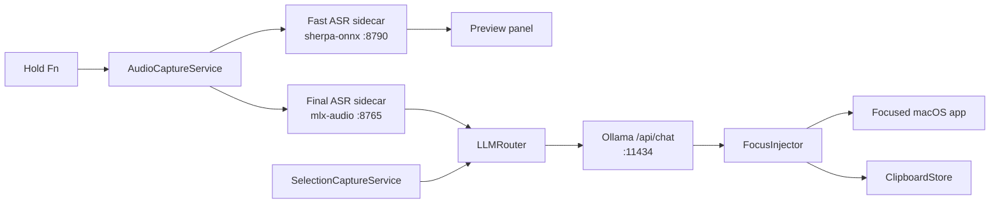

# MLX VoiceOps

English | [中文](README.zh.md)


MLX VoiceOps is a local-first macOS menu bar app for voice-driven writing and translation. Hold the activation key, speak, watch a low-latency preview, and release to run a final ASR pass plus an offline LLM rewrite before the result is inserted back into the focused app.

The project is built around Apple Silicon local inference: a SwiftUI/AppKit macOS app, FastAPI sidecars for speech recognition, and Ollama for offline text processing.

## What it does

- Hold-to-talk input: hold `Fn` by default to start recording, release to finish and inject the result.
- Streaming preview: a fast sherpa-onnx sidecar receives short PCM chunks and updates the floating preview while you speak.
- Final transcription: a mlx-audio sidecar runs the final WAV transcription on release.
- Offline LLM processing: Ollama `/api/chat` translates or polishes the final text with editable prompt templates.
- Selection translation: trigger a shortcut to capture selected text and translate it in a dedicated panel.
- Clipboard history: records clipboard items and VoiceOps outputs for quick reuse.
- Local sidecar lifecycle: the app can launch sidecars automatically when their virtual environments are ready.
- Focus-safe insertion: the preview does not become key, and final injection is skipped when focus moved away during recording.

By default, the built-in prompt profile translates spoken English into natural Chinese. You can change the voice and selection prompt templates in Preferences.

## Requirements

- macOS 13.0 or later
- Apple Silicon Mac recommended for MLX-based ASR
- Xcode for building the macOS app
- Python 3.9+ for sidecars
- Ollama for offline LLM processing
- `xcodegen` only if you edit `apps/macos/project.yml`

Model/runtime expectations:

- Final ASR defaults to `mlx-community/GLM-ASR-Nano-2512-8bit` through `ASR_MODEL_ID`.
- `sidecars/asr_mlx/server.py` sets `HF_HUB_OFFLINE=1`, so the default model should already be available in the local Hugging Face cache.
- Fast ASR expects sherpa-onnx transducer files under `models/zipformer` unless `FAST_ASR_MODEL_DIR` is set.
- Ollama defaults to `qwen2.5-coder:7b-instruct-q5_1`.

## Quick start

Clone the repo:

```bash
git clone https://github.com/xiaokhkh/mlx-voiceops.git
cd mlx-voiceops
```

Create the sidecar environments:

```bash
cd sidecars/asr_mlx
python3 -m venv .venv
source .venv/bin/activate
pip install -r requirements.txt
deactivate

cd ../fast_asr
python3 -m venv .venv
source .venv/bin/activate
pip install -r requirements.txt
deactivate
```

Prepare Ollama:

```bash
ollama serve
ollama pull qwen2.5-coder:7b-instruct-q5_1
```

Start sidecars during development:

```bash
./scripts/dev_run.sh
```

Build the macOS app:

1. Open `apps/macos/VoiceOps.xcodeproj` in Xcode.
2. Build and run the `VoiceOps` scheme.
3. Press `Command + Option + P`, open Permissions, and use each permission button once.

The app only reads permission status at launch and never loops automatic requests. A stable local signing requirement, `com.voiceops.VoiceOps`, lets macOS recognize rebuilds at the same path as the same app.

The app also tries to start sidecars on launch. It looks for `.venv/bin/python` in each sidecar directory, then falls back to `VOICEOPS_PYTHON_PATH` or `/usr/bin/python3`.

## Usage

- Hold `Fn`: record voice, show the floating preview, then process and insert the final result on release.
- Clipboard history shortcut: configurable, default `Command + Fn`.
- Selection translation shortcut: configurable in Preferences.
- Preferences: update activation keys, permissions, and LLM prompt templates.

The app inserts text with paste first and falls back to simulated typing. Accessibility permission is required for reliable injection.

## Architecture



Core pieces:

- `apps/macos/VoiceOps/AppMain.swift`: menu bar app startup, shortcuts, preferences, panels, and sidecar launcher.
- `apps/macos/VoiceOps/Services/FnSessionController.swift`: hold-to-talk session orchestration.
- `apps/macos/VoiceOps/Services/AudioCaptureService.swift`: microphone capture and WAV/PCM chunking.
- `apps/macos/VoiceOps/Services/FastASRClient.swift`: streaming preview client for the fast ASR sidecar.
- `apps/macos/VoiceOps/Services/ASRClient.swift`: final ASR client for the MLX sidecar.
- `apps/macos/VoiceOps/Services/OfflineLLMClient.swift`: Ollama chat client and prompt templates.
- `apps/macos/VoiceOps/Services/FocusInjector.swift`: focus-aware text injection.
- `apps/macos/VoiceOps/Clipboard/`: clipboard history models, storage, and UI.

## Sidecars and local endpoints

| Component | Default port | Endpoint | Purpose |
| --- | ---: | --- | --- |
| Final ASR | `8765` | `POST /v1/asr/transcribe` | Multipart WAV to final text |
| Fast ASR | `8790` | `POST /v1/fast_asr/start` | Create streaming session |
| Fast ASR | `8790` | `POST /v1/fast_asr/push` | Push base64 float32 PCM chunks |
| Fast ASR | `8790` | `POST /v1/fast_asr/end` | Close streaming session |
| Ollama | `11434` | `POST /api/chat` | Offline translation or polishing |

Sidecar logs are written to `~/Library/Logs/VoiceOps/sidecar_*.log` when launched by the app.

## Configuration

| Variable | Used by | Default | Notes |
| --- | --- | --- | --- |
| `ASR_MODEL_ID` | `asr_mlx` | `mlx-community/GLM-ASR-Nano-2512-8bit` | MLX final ASR model id |
| `FAST_ASR_MODEL_DIR` | `fast_asr` | `models/zipformer` | Directory containing `encoder.onnx`, `decoder.onnx`, `joiner.onnx`, `tokens.txt` |
| `FAST_ASR_SAMPLE_RATE` | `fast_asr` | `16000` | Incoming PCM sample rate |
| `FAST_ASR_NUM_THREADS` | `fast_asr` | `4` | sherpa-onnx decode threads |
| `VOICEOPS_SIDECAR_ROOT` | macOS app | auto-discovered `sidecars` | Override sidecar directory |
| `VOICEOPS_PYTHON_PATH` | macOS app | sidecar `.venv`, then `/usr/bin/python3` | Override Python executable for launched sidecars |

Prompt templates are stored in macOS user defaults and can be edited from Preferences.

## Repository layout

```text
apps/macos/VoiceOps/          macOS SwiftUI/AppKit app
apps/macos/project.yml        XcodeGen project definition
sidecars/asr_mlx/             FastAPI wrapper around mlx-audio final ASR
sidecars/fast_asr/            FastAPI sherpa-onnx streaming ASR service
models/zipformer/             Expected fast ASR model directory
docs/                         Project notes and generated README assets
scripts/dev_run.sh            Development sidecar launcher
```

## Development

Regenerate the Xcode project after editing `project.yml`:

```bash
cd apps/macos
xcodegen generate --spec project.yml
```

Useful checks:

```bash
./scripts/dev_run.sh
open apps/macos/VoiceOps.xcodeproj
```

Manual testing notes live in `docs/TESTING.md`.

## Permissions

- Microphone: required for voice capture.
- Accessibility: required for paste/type injection into other apps.
- Input Monitoring: required for global shortcuts.

Use Preferences -> Permissions to review permission state and open the relevant macOS Settings panes.

## Status

This is an active local-first prototype. The core path is already wired end to end, but model availability, Python environments, macOS permissions, and Ollama startup still need to be prepared on each development machine.
