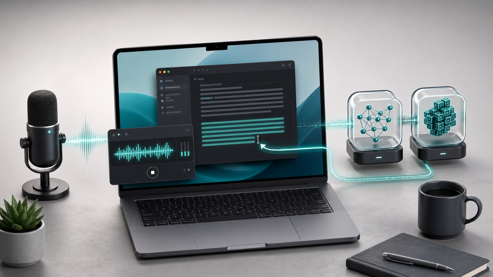
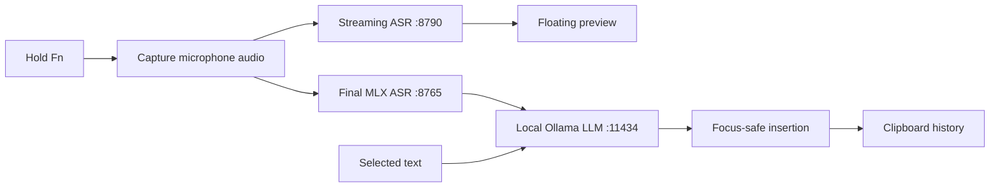

# MLX VoiceOps

English · [中文](README.zh.md)



MLX VoiceOps is a local-first macOS menu bar app for voice input, translation, and writing assistance. Hold `Fn`, speak naturally, and release: VoiceOps transcribes the complete utterance, runs an optional local rewrite, and inserts the result back into the app you were using.

The entire inference path runs on your Apple Silicon Mac with MLX, sherpa-onnx, and Ollama. Network access is only needed to install dependencies and download models.

> This project currently targets English-to-Chinese voice workflows by default. Translation, voice polishing, and action-summary prompts are editable in Preferences.

## What you can do

| Action | Default shortcut | Result |
| --- | --- | --- |
| Voice input | Hold `Fn`, then release | Live preview, final transcription, local LLM processing, and insertion |
| Translate selected text | `Command + Option + T` | Opens a streaming local translation panel |
| Open clipboard history | `Command + Fn` | Searches and reuses recent text, images, and VoiceOps output |
| Open Preferences | `Command + Option + P` | Opens setup even when the menu bar item is hidden |

VoiceOps combines two speech recognizers:

- a compact sherpa-onnx model for low-latency preview while you speak;
- a GLM-ASR MLX model for the accurate final transcript after release.

The final text is processed by the local Ollama model. If the model is unavailable, the voice workflow falls back to the original transcript instead of losing your input.

## Requirements

- macOS 13 or later
- Apple Silicon Mac
- Xcode
- Python 3.9 or later
- [Ollama for macOS](https://ollama.com/download/mac)
- Internet access during the first installation

The first installation downloads several gigabytes of models. The default install is per-user and does not require an administrator password.

## Install

Install and open Ollama first. Then run:

```bash
git clone https://github.com/xiaokhkh/mlx-voiceops.git
cd mlx-voiceops
./scripts/install.sh
```

The installer can be run again safely. It will:

1. create or update both Python virtual environments;
2. install the minimal speech-recognition dependency set;
3. download the streaming and final ASR models when missing;
4. start Ollama when necessary and pull the default LLM;
5. build the Release app;
6. install it at `~/Applications/VoiceOps.app`;
7. remember this checkout's sidecar location;
8. launch VoiceOps.

### First run

Preferences opens automatically the first time VoiceOps starts.

1. Open the **Permissions** tab.
2. Grant **Input Monitoring**, **Accessibility**, and **Microphone** access once.
3. Return to VoiceOps and click **Refresh Status**.
4. Confirm that permissions and Local Runtime items are green.
5. Focus a text field, hold `Fn`, speak, and release.

Permission requests are only triggered by the corresponding buttons or a voice action. VoiceOps does not repeatedly request permissions at launch.

## Diagnose a setup

Run the read-only doctor whenever installation or recognition is not working:

```bash
./scripts/doctor.sh
```

It checks the Mac architecture, build tools, Python environments, ASR models, local ports, Ollama model, installed app, code signature, and saved sidecar path.

Common fixes:

| Symptom | Fix |
| --- | --- |
| A model or environment is missing | Run `./scripts/install.sh` again |
| The repository was moved | Run the installer again to refresh the saved sidecar path |
| A local service is offline | Launch VoiceOps, then inspect logs from Preferences → Permissions → Open Logs |
| `Fn` does nothing | Enable Input Monitoring and avoid password fields while testing |
| Text is not inserted | Enable Accessibility and keep focus in the original target app |
| Microphone is unavailable | Use the Microphone button in Preferences; do not repeatedly relaunch the app |
| Ollama is unavailable | Open Ollama, then run `ollama pull qwen2.5-coder:7b-instruct-q5_1` |

Sidecar logs are stored in:

```text
~/Library/Logs/VoiceOps/
```

## Installer options

```text
./scripts/install.sh [options]

--skip-models       Keep existing ASR models and skip model downloads
--skip-ollama       Skip Ollama checks and the model pull
--no-launch         Install without opening VoiceOps
--install-dir PATH  Install outside ~/Applications
--python PATH       Use a specific Python 3.9+ executable
```

Environment overrides:

| Variable | Default | Purpose |
| --- | --- | --- |
| `VOICEOPS_INSTALL_DIR` | `~/Applications` | Per-user app installation directory |
| `VOICEOPS_SETUP_PYTHON` | `python3` | Python used to create sidecar environments |
| `VOICEOPS_OLLAMA_MODEL` | `qwen2.5-coder:7b-instruct-q5_1` | Ollama model prepared by the installer |
| `ASR_MODEL_ID` | `mlx-community/GLM-ASR-Nano-2512-8bit` | Final MLX ASR model |
| `FAST_ASR_MODEL_DIR` | `models/zipformer` | Streaming model directory |
| `FAST_ASR_SAMPLE_RATE` | `16000` | Streaming PCM sample rate |
| `FAST_ASR_NUM_THREADS` | `4` | Streaming decoder thread count |
| `VOICEOPS_SIDECAR_ROOT` | Auto-discovered | Override the sidecar directory used by the app |
| `VOICEOPS_PYTHON_PATH` | Sidecar `.venv` | Override the Python executable used by the app |

## Local models and data

| Component | Default | Local location |
| --- | --- | --- |
| Streaming ASR | sherpa-onnx bilingual Zipformer | `models/zipformer/` |
| Final ASR | `mlx-community/GLM-ASR-Nano-2512-8bit` | Hugging Face cache |
| Text processing | `qwen2.5-coder:7b-instruct-q5_1` | Ollama model store |
| Clipboard history | Up to 200 recent items | `~/Library/Application Support/mlx-voiceops/` |
| Runtime logs | Sidecar stdout and stderr | `~/Library/Logs/VoiceOps/` |

After setup, audio transcription and LLM processing use loopback-only local services. Prompt templates are stored in macOS user defaults and can be edited under Preferences → LLM.

## How it works



The preview window never takes keyboard focus. VoiceOps remembers the foreground app at the beginning of a recording and skips automatic insertion if focus changes before processing finishes.

## Development

The installer is also the fastest way to prepare a development checkout. To run the sidecars manually afterward:

```bash
./scripts/dev_run.sh
```

Open the macOS project:

```bash
open apps/macos/VoiceOps.xcodeproj
```

If `apps/macos/project.yml` changes, regenerate the Xcode project:

```bash
cd apps/macos
xcodegen generate --spec project.yml
```

Useful verification commands:

```bash
./scripts/doctor.sh
python3 -m py_compile sidecars/asr_mlx/server.py sidecars/fast_asr/server.py
xcodebuild -project apps/macos/VoiceOps.xcodeproj \
  -scheme VoiceOps -configuration Release build
```

Manual product checks are documented in [docs/TESTING.md](docs/TESTING.md).

### Local endpoints

| Service | Port | Endpoint |
| --- | ---: | --- |
| Final ASR | `8765` | `GET /health` |
| Final ASR | `8765` | `POST /v1/asr/transcribe` |
| Streaming ASR | `8790` | `GET /health` |
| Streaming ASR | `8790` | `POST /v1/fast_asr/start` |
| Streaming ASR | `8790` | `POST /v1/fast_asr/push` |
| Streaming ASR | `8790` | `POST /v1/fast_asr/end` |
| Ollama | `11434` | `POST /api/chat` |

### Repository layout

```text
apps/macos/VoiceOps/          SwiftUI and AppKit application
apps/macos/project.yml        XcodeGen project definition
sidecars/asr_mlx/             Final GLM-ASR service
sidecars/fast_asr/            Streaming sherpa-onnx service
scripts/install.sh            Repeatable per-user installer
scripts/doctor.sh             Read-only setup diagnostics
scripts/dev_run.sh            Manual sidecar launcher
docs/                         Testing notes and project assets
```

## Project status

MLX VoiceOps is an active local-first prototype. The main voice pipeline works end to end, but startup latency and recognition quality still depend on the Mac, microphone, language mix, and selected local models.
