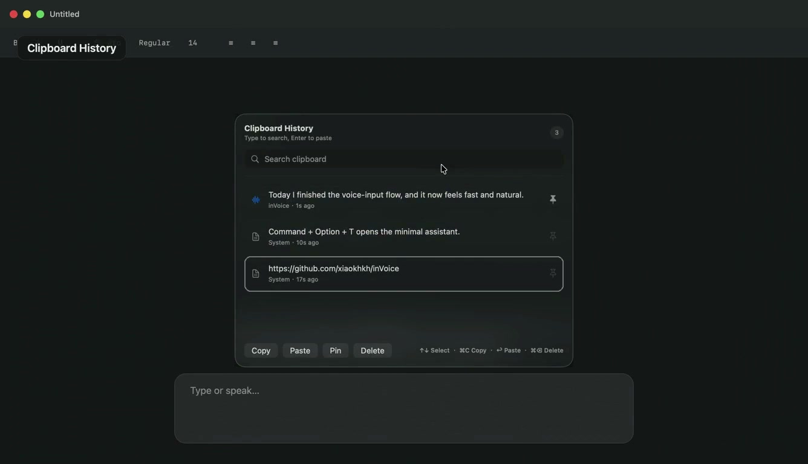
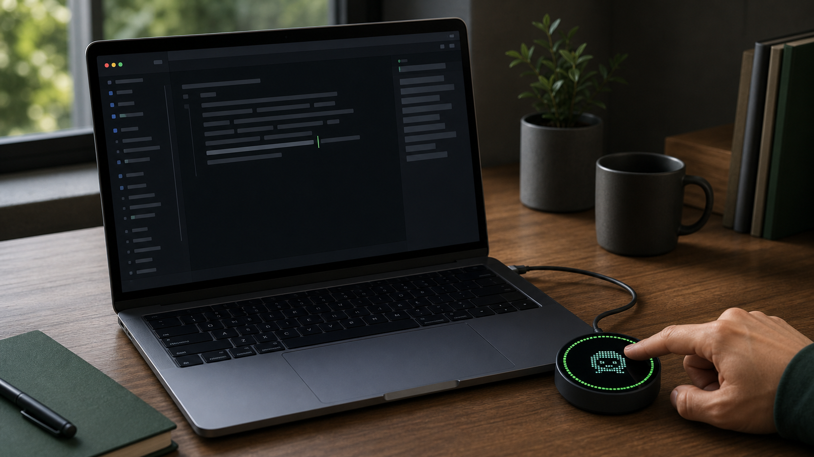
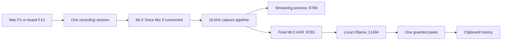

# inVoice

English · [中文](README.zh.md)

<p align="center">
  
</p>

<p align="center">
  <strong>Hold. Speak. Release. Keep typing.</strong><br>
  Private, local voice input for every text field on your Mac.
</p>

<p align="center">
  <a href="https://github.com/xiaokhkh/inVoice/releases/latest">Download</a> ·
  <a href="#quick-start">Quick start</a> ·
  <a href="README.zh.md">中文文档</a>
</p>

<p align="center">
  
  
  
  <a href="LICENSE"></a>
</p>

[](docs/assets/invoice-usage-demo.mp4)

**One-screen usage demo:** `Fn` voice input with final **GLM-ASR + LLM
proofreading**, searchable clipboard history, and the `Command + Option + T`
minimal assistant. [Watch the MP4](docs/assets/invoice-usage-demo.mp4).

inVoice is a local-first macOS menu bar app for voice input, translation,
and writing assistance. Hold the Mac `Fn` key, speak naturally, then release:
the final text is inserted once into the app you were already using. No
development board is required.

For a tactile desk setup, connect the optional round Waveshare ESP32-S3
microphone and use its display as a push-to-talk surface. It adds hardware
controls without changing the Mac-only workflow.

Speech recognition and optional rewriting run locally on Apple Silicon with
MLX, sherpa-onnx, and Ollama. Network access is only needed to install
dependencies and download models.

> The default prompt turns Chinese speech into natural English. Voice,
> translation, and action-summary prompts are editable in inVoice Settings.

## Why inVoice

- **Works where you already type.** Use it in ChatGPT, Codex, Mail, Notes,
  browsers, editors, and chat apps without moving text between windows.
- **Private after setup.** Audio, transcripts, rewrites, and clipboard history
  stay on your Mac; local services listen only on loopback.
- **Safe delivery.** The result is pasted only if the original app is still in
  front. Otherwise it stays on the clipboard instead of landing in the wrong place.
- **Useful beyond dictation.** Search clipboard history, translate a selection,
  and tune local writing prompts from one menu bar app.
- **Hardware is optional.** Start with the Mac keyboard and add the supported
  ESP32-S3 push-to-talk microphone only if you want a physical control surface.

## At a glance

| Area | Default behavior |
| --- | --- |
| Activation | Hold Mac `Fn`, the board touchscreen, or the board PWR button |
| Audio source | Prefer `MLX Voice Mic` while connected; otherwise use the current macOS input |
| Recognition | Low-latency sherpa-onnx preview plus final GLM-ASR MLX transcription |
| Text processing | Optional local Ollama rewrite, with the transcript as the fallback |
| Delivery | One focus-guarded paste per recording; copy-only fallback if focus changed |
| Privacy | Audio, text, clipboard history, and inference remain on the Mac after setup |

## Everyday controls

| Action | Mac | ESP32-S3 board | Result |
| --- | --- | --- | --- |
| Voice input | Hold `Fn`, then release | Hold the display or PWR, then release | Preview, final recognition, optional rewrite, and one insertion |
| Clipboard history | `Command + Fn` | Press BOOT once | Toggle the searchable clipboard panel |
| Submit current input | Press `Return` | Short-tap the display | Send one standard Return to the frontmost application |
| Local assistant | `Command + Option + T` | — | Open a minimal local dialog; selected English is translated into Simplified Chinese by default |
| Settings | `Command + Option + P` | — | Open setup, permissions, models, and prompts |

When the board is connected, every new recording prefers its USB microphone.
After it is unplugged, the next recording transparently falls back to the
current macOS input. Board F13/F14 reports are accepted only from its exact USB
VID/PID, so docks and unrelated keyboards cannot create a second recording.

## Supported microphone hardware



The firmware in this repository targets the **Waveshare
ESP32-S3-Touch-AMOLED-1.75**, standard model **SKU 31261**. This is the original
1.75-inch board, not the newer `1.75C` product.

| Part | Model / specification | Role in inVoice |
| --- | --- | --- |
| Board | `ESP32-S3-Touch-AMOLED-1.75`, SKU `31261` | Tested firmware target |
| SoC | `ESP32-S3R8`, dual-core LX7 up to 240 MHz | USB Audio, HID, OTA, UI, and audio capture |
| Memory | 8 MB PSRAM + external 16 MB Flash | Dual OTA slots plus preserved Jam assets |
| AMOLED | 1.75 inch, 466×466, `CO5300` over QSPI | Jam animation and full-dial level ring |
| Touch | `CST9217` over I2C | Hold-to-talk and short-tap Return |
| Audio ADC | `ES7210`, dual onboard microphones | 24 kHz mono, 16-bit USB microphone stream |
| Power / I/O | `AXP2101` + `TCA9554` | PWR input, power control, and GPIO expansion |
| Sensors | `QMI8658` IMU + `PCF85063` RTC | Present on the board; not required by inVoice |

Waveshare also lists the `-B` enclosure version as SKU `31262` and the `-G` GPS
version as SKU `31264`. They are official variants, but this project currently
regression-tests only SKU `31261`. Do not flash this image onto
`ESP32-S3-Touch-AMOLED-1.75C`.

The model numbers and board specifications above are cross-checked against the
[official Waveshare documentation](https://docs.waveshare.com/ESP32-S3-Touch-AMOLED-1.75)
and the [ESP32-S3 datasheet](https://www.espressif.com/sites/default/files/documentation/esp32-s3_datasheet_en.pdf).

### Board UI and USB interfaces

- Hold the display or PWR to send the private F13 push-to-talk state.
- Release to finish the same recording. Natural speech never starts a session.
- Short-tap the display to send one standard USB HID Return directly to the
  frontmost application. Hold it for 250 ms to start push-to-talk instead.
  This works without app-specific host translation or Accessibility permission.
- While held, the preserved Jam character switches to its thinking state and a
  speech-sensitive green ring runs around the full display.
- Press BOOT during normal operation to send F14 and toggle clipboard history.
- The board enumerates as `MLX Voice Mic`: USB Audio + keyboard HID + an
  independent vendor HID updater, VID/PID `0x303A:0x4002`.
- A 40 ms touch filter recognizes quick taps; PWR and BOOT retain their 100 ms
  filter. Periodic absolute HID state and forced release protect the workflow
  across USB docks and hot-plug events.

The original Xiaozhi Jam GIF resources stay in the Flash `assets` partition at
`0x800000`; the firmware reads them in place and does not replace them.

## How the voice path works



The preview window never takes keyboard focus. inVoice records the foreground
application at session start and sends exactly one private Cmd+V only if that
application is still in front. If focus changed or event delivery is
unavailable, the final text remains on the clipboard for manual recovery.

## Requirements

- macOS 13 or later
- Apple Silicon Mac
- Python 3.9 or later
- [Ollama for macOS](https://ollama.com/download/mac)
- Internet access during first installation
- Xcode only when building from source
- Optional hardware path: Waveshare SKU `31261` and a data-capable USB Type-C cable

The first installation downloads several gigabytes of models. The default
install is per-user and does not require an administrator password.

## Quick start

### Install the beta

1. Install and open [Ollama](https://ollama.com/download/mac), and make sure
   `python3` is available.
2. Download the Apple Silicon DMG from the
   [latest GitHub Release](https://github.com/xiaokhkh/inVoice/releases/latest).
3. Open the DMG and double-click **Install inVoice.command**. It installs the
   app under `~/Applications` and downloads the local models for your account.
4. If macOS blocks the ad-hoc-signed beta, right-click the installer and choose
   **Open**, then confirm it under **System Settings → Privacy & Security**.

The installer is intentionally readable shell code. It does not request an
administrator password, and audio inference still runs locally after setup.

### Build from source

Install and open Ollama first, then run:

```bash
git clone https://github.com/xiaokhkh/inVoice.git
cd inVoice
./scripts/install.sh
```

The repeatable source installer prepares both Python environments, downloads
missing ASR models, prepares the default Ollama model, builds the Release app,
installs it at `~/Applications/inVoice.app`, records the checkout's sidecar
path, and launches inVoice.

### First run

1. Open **inVoice Settings** → **Permissions**.
2. Grant **Input Monitoring**, **Accessibility**, and **Microphone** once.
3. Return to inVoice and click **Refresh Status**.
4. Confirm that permissions and Local Runtime items are green.
5. Focus a text field, hold `Fn` or the board display, speak, and release.

Permission prompts are only triggered by the matching setup button or voice
action. inVoice does not repeatedly request permissions at launch.

## Install and update the board firmware

Build with ESP-IDF 5.5.x from the firmware directory:

```bash
cd firmware/esp32-s3-touch-amoled-1.75
idf.py set-target esp32s3
idf.py build
```

The first installation writes a new dual-slot partition table. Use the
ESP32-S3 ROM downloader once over the same Type-C cable: hold BOOT while
reconnecting the cable, release it after the ROM device appears, then run:

```bash
idf.py -p /dev/cu.usbmodemXXXX flash
```

Never run `erase-flash`: the Jam assets occupy `0x800000-0xFFFFFF` and are
deliberately preserved.

After that one-time installation, update a normally running board without any
button press, Wi-Fi setup, or 5-wire adapter:

```bash
./scripts/update_esp32_firmware.sh
```

The updater validates the image and CRC, writes the inactive OTA slot, selects
it atomically, and restarts the board over the existing Type-C connection.

See the [firmware guide](firmware/esp32-s3-touch-amoled-1.75/README.md),
[USB OTA protocol](docs/ESP32_USB_OTA_PROTOCOL.md), and
[Chinese hardware handoff](docs/ESP32_S3_TOUCH_AMOLED_1_75_ZH.md) for recovery,
partition, and integration details.

## Diagnose a setup

Run the read-only doctor whenever installation or recognition is not working:

```bash
./scripts/doctor.sh
```

| Symptom | Check or fix |
| --- | --- |
| `Fn` does nothing | Enable Input Monitoring; avoid password fields while testing |
| Board does not start dictation | Confirm `MLX Voice Mic` is present and the app has Input Monitoring access |
| Board stays in input state | Reconnect it and confirm current firmware; removal should force a release |
| Text is recognized but not inserted | Enable Accessibility and keep the original target app in front; otherwise recover it from the clipboard |
| Board audio is not selected | Confirm the USB Audio device is named `MLX Voice Mic`; a new session selects it automatically |
| A model or environment is missing | Run `./scripts/install.sh` again |
| Ollama is unavailable | Open Ollama, then run `ollama pull qwen2.5-coder:7b-instruct-q5_1` |

Runtime logs are stored in `~/Library/Logs/VoiceOps/`.

### Installer options

```text
./scripts/install.sh [options]

--skip-models       Keep existing ASR models and skip model downloads
--skip-ollama       Skip Ollama checks and the model pull
--no-launch         Install without opening inVoice
--install-dir PATH  Install outside ~/Applications
--python PATH       Use a specific Python 3.9+ executable
```

### Environment overrides

| Variable | Default | Purpose |
| --- | --- | --- |
| `VOICEOPS_INSTALL_DIR` | `~/Applications` | Per-user app installation directory |
| `VOICEOPS_SETUP_PYTHON` | `python3` | Python used to create sidecar environments |
| `VOICEOPS_OLLAMA_MODEL` | `qwen2.5-coder:7b-instruct-q5_1` | Ollama model prepared by the installer |
| `ASR_MODEL_ID` | `mlx-community/GLM-ASR-Nano-2512-8bit` | Final MLX ASR model |
| `FAST_ASR_MODEL_DIR` | `models/zipformer` | Streaming model directory |
| `FAST_ASR_SAMPLE_RATE` | `16000` | Streaming PCM sample rate |
| `FAST_ASR_NUM_THREADS` | `4` | Streaming decoder thread count |
| `VOICEOPS_SIDECAR_ROOT` | Auto-discovered | Override the sidecar directory used by the app |
| `VOICEOPS_PYTHON_PATH` | Sidecar `.venv` | Override the Python executable used by the app |

## Local models and data

| Component | Default | Local location |
| --- | --- | --- |
| Streaming ASR | sherpa-onnx bilingual Zipformer | `models/zipformer/` |
| Final ASR | `mlx-community/GLM-ASR-Nano-2512-8bit` | Hugging Face cache |
| Text processing | `qwen2.5-coder:7b-instruct-q5_1` | Ollama model store |
| Clipboard history | Up to 200 recent items | `~/Library/Application Support/mlx-voiceops/` |
| Runtime logs | Sidecar stdout and stderr | `~/Library/Logs/VoiceOps/` |

After setup, transcription and LLM processing use loopback-only local services.
Prompt templates are stored in macOS user defaults and can be edited under
inVoice Settings → LLM.

## Development

The installer is also the fastest way to prepare a development checkout. To
run the sidecars manually afterward:

```bash
./scripts/dev_run.sh
open apps/macos/VoiceOps.xcodeproj
```

If `apps/macos/project.yml` changes, regenerate the Xcode project:

```bash
cd apps/macos
xcodegen generate --spec project.yml
```

Useful verification commands:

```bash
./scripts/doctor.sh
python3 -m py_compile sidecars/asr_mlx/server.py sidecars/fast_asr/server.py
xcodebuild -project apps/macos/VoiceOps.xcodeproj \
  -scheme VoiceOps -configuration Release build
```

Manual product checks are documented in [docs/TESTING.md](docs/TESTING.md).

The user-facing product and app bundle are named `inVoice`. The existing Xcode
target, bundle identifier, and `VoiceOps` support/log directory names remain
unchanged internally so upgrades retain macOS permissions and local data.

### Local endpoints

| Service | Port | Endpoint |
| --- | ---: | --- |
| Final ASR | `8765` | `GET /health` |
| Final ASR | `8765` | `POST /v1/asr/transcribe` |
| Streaming ASR | `8790` | `GET /health` |
| Streaming ASR | `8790` | `POST /v1/fast_asr/start` |
| Streaming ASR | `8790` | `POST /v1/fast_asr/push` |
| Streaming ASR | `8790` | `POST /v1/fast_asr/end` |
| Ollama | `11434` | `POST /api/chat` |

### Repository layout

```text
apps/macos/VoiceOps/                    SwiftUI and AppKit application
sidecars/asr_mlx/                       Final GLM-ASR service
sidecars/fast_asr/                      Streaming sherpa-onnx service
firmware/esp32-s3-touch-amoled-1.75/   USB microphone and OTA firmware
scripts/                                Installer, diagnostics, and updater
docs/                                   Protocols, handoff notes, tests, and assets
```

## Project status

inVoice is an active local-first prototype. The end-to-end Mac and
ESP32-S3 path is working, including dock-safe push-to-talk, hot-plug microphone
fallback, one-shot text delivery, and button-free subsequent OTA. Startup
latency and recognition quality still depend on the Mac, language mix, and
selected local models.
