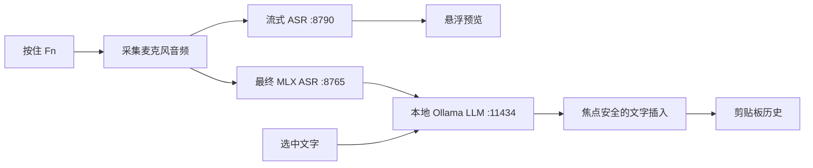

# MLX VoiceOps

中文 · [English](README.en.md)


MLX VoiceOps 是一款本地优先的 macOS 菜单栏语音工具，用于语音输入、翻译和写作辅助。按住 `Fn` 自然说话，松开后，VoiceOps 会完成最终识别、按需进行本地改写，并把结果插回你正在使用的应用。

整条推理链路运行在 Apple Silicon Mac 本机，使用 MLX、sherpa-onnx 和 Ollama。只有首次安装依赖和下载模型时需要联网。

> 当前默认面向“英文语音转自然中文”的使用场景。选中文本翻译、语音润色和行动摘要的提示词都可以在 Preferences 中修改。

## 可以做什么

| 操作 | 默认快捷键 | 结果 |
| --- | --- | --- |
| 语音输入 | 按住 `Fn`，说完松开 | 实时预览、最终识别、本地 LLM 处理并插入文字 |
| 翻译选中文字 | `Command + Option + T` | 打开流式本地翻译面板 |
| 打开剪贴板历史 | `Command + Fn` | 搜索和复用最近的文字、图片及 VoiceOps 输出 |
| 打开设置 | `Command + Option + P` | 即使菜单栏图标被隐藏，也能进入设置和诊断 |

VoiceOps 组合了两套语音识别模型：

- 说话过程中，使用轻量 sherpa-onnx 模型提供低延迟预览；
- 松开按键后，使用 GLM-ASR MLX 模型生成更准确的最终结果。

最终文本交给本地 Ollama 模型处理。如果 Ollama 暂时不可用，语音流程会回退到原始识别结果，不会丢失输入。

## 环境要求

- macOS 13 或更高版本
- Apple Silicon Mac
- Xcode
- Python 3.9 或更高版本
- [macOS 版 Ollama](https://ollama.com/download/mac)
- 首次安装时可访问互联网

首次安装会下载数 GB 的本地模型。默认安装在当前用户目录，不需要管理员密码。

## 安装

先安装并打开 Ollama，然后运行：

```bash
git clone https://github.com/xiaokhkh/mlx-voiceops.git
cd mlx-voiceops
./scripts/install.sh
```

安装器可以安全地重复运行，它会依次：

1. 创建或更新两个 Python 虚拟环境；
2. 安装语音识别实际需要的最小依赖；
3. 在模型缺失时下载流式和最终 ASR 模型；
4. 在需要时启动 Ollama，并拉取默认 LLM；
5. 构建 Release App；
6. 安装到 `~/Applications/VoiceOps.app`；
7. 记录当前仓库的 sidecar 位置；
8. 启动 VoiceOps。

### 首次运行

VoiceOps 第一次启动时会自动打开 Preferences。

1. 进入 **Permissions** 页面。
2. 分别授予一次 **输入监控**、**辅助功能**和**麦克风**权限。
3. 回到 VoiceOps，点击 **Refresh Status**。
4. 确认权限与 Local Runtime 项目全部为绿色。
5. 聚焦任意文本输入框，按住 `Fn` 说话，松开后等待结果插入。

系统权限只会由相应按钮或语音操作触发。VoiceOps 启动时不会反复弹出权限请求。

## 诊断安装状态

安装或识别异常时，运行只读诊断：

```bash
./scripts/doctor.sh
```

它会检查 Mac 架构、构建工具、Python 环境、ASR 模型、本地端口、Ollama 模型、已安装 App、代码签名和保存的 sidecar 路径。

常见问题：

| 现象 | 处理方式 |
| --- | --- |
| 缺少模型或 Python 环境 | 重新运行 `./scripts/install.sh` |
| 移动了仓库目录 | 重新运行安装器，刷新保存的 sidecar 路径 |
| 本地服务未启动 | 启动 VoiceOps，然后在 Preferences → Permissions → Open Logs 查看日志 |
| 按住 `Fn` 没反应 | 打开输入监控权限；测试时避开密码输入框 |
| 结果没有插入 | 打开辅助功能权限，并保持原目标应用处于聚焦状态 |
| 麦克风不可用 | 在 Preferences 中点击麦克风按钮，不要反复重启 App |
| Ollama 不可用 | 打开 Ollama，再运行 `ollama pull qwen2.5-coder:7b-instruct-q5_1` |

Sidecar 日志位于：

```text
~/Library/Logs/VoiceOps/
```

## 安装器选项

```text
./scripts/install.sh [options]

--skip-models       保留已有 ASR 模型并跳过模型下载
--skip-ollama       跳过 Ollama 检查和模型拉取
--no-launch         安装后不打开 VoiceOps
--install-dir PATH  安装到 ~/Applications 以外的位置
--python PATH       使用指定的 Python 3.9+ 可执行文件
```

环境变量：

| 变量 | 默认值 | 用途 |
| --- | --- | --- |
| `VOICEOPS_INSTALL_DIR` | `~/Applications` | 当前用户的 App 安装目录 |
| `VOICEOPS_SETUP_PYTHON` | `python3` | 创建 sidecar 环境所用的 Python |
| `VOICEOPS_OLLAMA_MODEL` | `qwen2.5-coder:7b-instruct-q5_1` | 安装器准备的 Ollama 模型 |
| `ASR_MODEL_ID` | `mlx-community/GLM-ASR-Nano-2512-8bit` | 最终 MLX ASR 模型 |
| `FAST_ASR_MODEL_DIR` | `models/zipformer` | 流式模型目录 |
| `FAST_ASR_SAMPLE_RATE` | `16000` | 流式 PCM 采样率 |
| `FAST_ASR_NUM_THREADS` | `4` | 流式解码线程数 |
| `VOICEOPS_SIDECAR_ROOT` | 自动发现 | 覆盖 App 使用的 sidecar 目录 |
| `VOICEOPS_PYTHON_PATH` | sidecar `.venv` | 覆盖 App 启动 sidecar 使用的 Python |

## 本地模型与数据

| 组件 | 默认模型或内容 | 本地位置 |
| --- | --- | --- |
| 流式 ASR | sherpa-onnx 中英双语 Zipformer | `models/zipformer/` |
| 最终 ASR | `mlx-community/GLM-ASR-Nano-2512-8bit` | Hugging Face 缓存 |
| 文本处理 | `qwen2.5-coder:7b-instruct-q5_1` | Ollama 模型目录 |
| 剪贴板历史 | 最近最多 200 项 | `~/Library/Application Support/mlx-voiceops/` |
| 运行日志 | Sidecar 标准输出与错误 | `~/Library/Logs/VoiceOps/` |

完成首次下载后，语音识别和 LLM 处理都通过仅监听本机回环地址的服务完成。提示词模板存储在 macOS user defaults 中，可在 Preferences → LLM 中编辑。

## 工作原理



预览窗口不会抢走键盘焦点。VoiceOps 会记住录音开始时的前台应用；如果处理完成前焦点发生变化，会跳过自动插入，避免把内容写到错误的位置。

## 开发

安装器也是准备开发环境最快的方式。完成安装后，可以手动启动 sidecar：

```bash
./scripts/dev_run.sh
```

打开 macOS 工程：

```bash
open apps/macos/VoiceOps.xcodeproj
```

修改 `apps/macos/project.yml` 后重新生成 Xcode 工程：

```bash
cd apps/macos
xcodegen generate --spec project.yml
```

常用验证命令：

```bash
./scripts/doctor.sh
python3 -m py_compile sidecars/asr_mlx/server.py sidecars/fast_asr/server.py
xcodebuild -project apps/macos/VoiceOps.xcodeproj \
  -scheme VoiceOps -configuration Release build
```

产品手动测试清单见 [docs/TESTING.md](docs/TESTING.md)。

### 本地端点

| 服务 | 端口 | 端点 |
| --- | ---: | --- |
| 最终 ASR | `8765` | `GET /health` |
| 最终 ASR | `8765` | `POST /v1/asr/transcribe` |
| 流式 ASR | `8790` | `GET /health` |
| 流式 ASR | `8790` | `POST /v1/fast_asr/start` |
| 流式 ASR | `8790` | `POST /v1/fast_asr/push` |
| 流式 ASR | `8790` | `POST /v1/fast_asr/end` |
| Ollama | `11434` | `POST /api/chat` |

### 目录结构

```text
apps/macos/VoiceOps/          SwiftUI 与 AppKit 应用
apps/macos/project.yml        XcodeGen 工程定义
sidecars/asr_mlx/             最终 GLM-ASR 服务
sidecars/fast_asr/            流式 sherpa-onnx 服务
scripts/install.sh            可重复执行的用户级安装器
scripts/doctor.sh             只读安装状态诊断
scripts/dev_run.sh            手动 sidecar 启动器
docs/                         测试说明和项目资源
```

## 项目状态

MLX VoiceOps 仍是一个活跃开发中的本地优先原型。主要语音链路已经端到端可用，但启动速度和识别效果仍会受到设备、麦克风、语言混合方式以及所选本地模型的影响。
