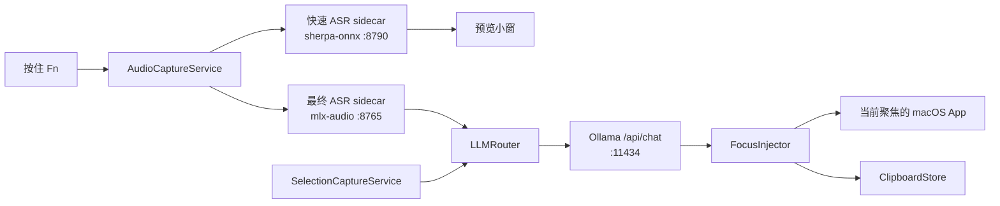

# MLX VoiceOps

中文 | [English](README.en.md)


MLX VoiceOps 是一个本地优先的 macOS 菜单栏 App，用于语音输入、翻译和写作辅助。按住激活键说话时，它会显示低延迟预览；松开后运行最终 ASR 和离线 LLM 改写，再把结果插回当前聚焦的应用。

项目围绕 Apple Silicon 本地推理构建：SwiftUI/AppKit macOS App、用于语音识别的 FastAPI sidecar，以及用于离线文本处理的 Ollama。

## 它能做什么

- 按住说话：默认按住 `Fn` 开始录音，松开后处理并注入结果。
- 流式预览：快速 sherpa-onnx sidecar 接收短 PCM 分片，并在你说话时更新悬浮预览。
- 最终转写：松开按键后，mlx-audio sidecar 对完整 WAV 做最终识别。
- 离线 LLM 处理：通过 Ollama `/api/chat` 对最终文本做翻译或润色，提示词可配置。
- 选中文本翻译：通过快捷键捕获当前选中文本，并在独立面板中翻译。
- 剪贴板历史：记录普通剪贴板内容和 VoiceOps 输出，方便复用。
- 本地 sidecar 生命周期：当虚拟环境准备好时，App 可在启动时自动拉起 sidecar。
- 焦点安全注入：预览小窗不会抢焦点；如果录音期间焦点切走，最终注入会跳过。

默认提示词会把英文语音翻译成自然中文。语音和选中文本的提示词模板都可以在 Preferences 中调整。

## 环境要求

- macOS 13.0 或更高版本
- 推荐 Apple Silicon Mac，用于 MLX ASR
- Xcode，用于构建 macOS App
- Python 3.9+，用于 sidecar
- Ollama，用于离线 LLM
- 只有修改 `apps/macos/project.yml` 时才需要 `xcodegen`

模型和运行时预期：

- 最终 ASR 默认使用 `ASR_MODEL_ID=mlx-community/GLM-ASR-Nano-2512-8bit`。
- `sidecars/asr_mlx/server.py` 以离线模式运行；安装器会先把所选模型下载到本机 Hugging Face 缓存。
- 快速 ASR 默认从 `models/zipformer` 读取 sherpa-onnx transducer 文件，除非设置了 `FAST_ASR_MODEL_DIR`。
- Ollama 默认模型为 `qwen2.5-coder:7b-instruct-q5_1`。

## 一键安装

先安装 [macOS 版 Ollama](https://ollama.com/download/mac)，然后克隆仓库并运行安装器：


```bash
git clone https://github.com/xiaokhkh/mlx-voiceops.git
cd mlx-voiceops
./scripts/install.sh
```

安装器可以安全地重复执行，它会：

- 创建并更新两个 Python 虚拟环境；
- 下载轻量的中英双语流式模型和最终 MLX ASR 模型；
- 在需要时启动 Ollama，并拉取默认本地 LLM；
- 构建 Release App，安装到 `~/Applications/VoiceOps.app`；
- 记录当前仓库的 sidecar 路径，让安装后的 App 能自动启动本地服务；
- 启动 VoiceOps，并在首次运行时自动打开 Preferences。

首次安装需要下载数 GB 的本地模型，不需要管理员密码。常用选项：

```text
--skip-models       保留已有 ASR 模型并跳过下载
--skip-ollama       跳过 Ollama 检查和模型拉取
--no-launch         安装后不启动 App
--install-dir PATH  选择其他用户级 App 安装目录
--python PATH       指定 Python 3.9+ 可执行文件
```

随时可以运行只读诊断，检查完整安装状态：

```bash
./scripts/doctor.sh
```

首次启动时，Preferences 会自动打开到设置清单。分别点击一次麦克风、辅助功能和输入监控的授权按钮即可。之后即使菜单栏图标被隐藏，也可以按 `Command + Option + P` 重新打开。

App 启动时只读取权限状态，不会自动循环请求。项目使用固定的本地签名 requirement `com.voiceops.VoiceOps`，因此同一路径下重新构建后，macOS 仍能识别为同一个 App。Permissions 面板也会显示两个 sidecar 环境和流式模型是否就绪，并可直接打开本地日志。

## 使用方式

- 按住 `Fn`：录音、显示悬浮预览，松开后处理并插入最终结果。
- 剪贴板历史快捷键：可配置，默认 `Command + Fn`。
- 选中文本翻译快捷键：可在 Preferences 中配置。
- Preferences：配置激活键、权限状态和 LLM 提示词模板。

App 会优先通过粘贴注入文本，失败时回退到模拟键入。要可靠注入到其他 App，需要开启辅助功能权限。

## 架构



核心模块：

- `apps/macos/VoiceOps/AppMain.swift`：菜单栏 App 启动、快捷键、偏好设置、面板和 sidecar launcher。
- `apps/macos/VoiceOps/Services/FnSessionController.swift`：按住说话会话编排。
- `apps/macos/VoiceOps/Services/AudioCaptureService.swift`：麦克风采集和 WAV/PCM 分片。
- `apps/macos/VoiceOps/Services/FastASRClient.swift`：连接快速 ASR sidecar 的流式预览客户端。
- `apps/macos/VoiceOps/Services/ASRClient.swift`：连接 MLX sidecar 的最终 ASR 客户端。
- `apps/macos/VoiceOps/Services/OfflineLLMClient.swift`：Ollama chat 客户端和提示词模板。
- `apps/macos/VoiceOps/Services/FocusInjector.swift`：感知焦点的文本注入。
- `apps/macos/VoiceOps/Clipboard/`：剪贴板历史的数据模型、存储和 UI。

## Sidecar 和本地端点

| 组件 | 默认端口 | 端点 | 用途 |
| --- | ---: | --- | --- |
| 最终 ASR | `8765` | `GET /health` | 安装诊断使用的就绪检查 |
| 最终 ASR | `8765` | `POST /v1/asr/transcribe` | Multipart WAV 转最终文本 |
| 快速 ASR | `8790` | `POST /v1/fast_asr/start` | 创建流式识别会话 |
| 快速 ASR | `8790` | `POST /v1/fast_asr/push` | 推送 base64 float32 PCM 分片 |
| 快速 ASR | `8790` | `POST /v1/fast_asr/end` | 结束流式识别会话 |
| Ollama | `11434` | `POST /api/chat` | 离线翻译或润色 |

由 App 拉起 sidecar 时，日志会写入 `~/Library/Logs/VoiceOps/sidecar_*.log`。

## 配置项

| 变量 | 使用方 | 默认值 | 说明 |
| --- | --- | --- | --- |
| `ASR_MODEL_ID` | `asr_mlx` | `mlx-community/GLM-ASR-Nano-2512-8bit` | MLX 最终 ASR 模型 id |
| `FAST_ASR_MODEL_DIR` | `fast_asr` | `models/zipformer` | 包含 `encoder.onnx`、`decoder.onnx`、`joiner.onnx`、`tokens.txt` 的目录 |
| `FAST_ASR_SAMPLE_RATE` | `fast_asr` | `16000` | 输入 PCM 采样率 |
| `FAST_ASR_NUM_THREADS` | `fast_asr` | `4` | sherpa-onnx 解码线程数 |
| `VOICEOPS_SIDECAR_ROOT` | macOS App | 自动发现 `sidecars` | 覆盖 sidecar 根目录 |
| `VOICEOPS_PYTHON_PATH` | macOS App | sidecar `.venv`，再到 `/usr/bin/python3` | 覆盖 App 拉起 sidecar 时使用的 Python |

提示词模板存储在 macOS user defaults 中，可在 Preferences 里编辑。

## 目录结构

```text
apps/macos/VoiceOps/          SwiftUI/AppKit macOS App
apps/macos/project.yml        XcodeGen 项目定义
sidecars/asr_mlx/             基于 mlx-audio 的最终 ASR FastAPI wrapper
sidecars/fast_asr/            基于 sherpa-onnx 的流式 ASR FastAPI 服务
models/zipformer/             快速 ASR 默认模型目录
docs/                         项目说明和 README 配图资产
scripts/dev_run.sh            开发用 sidecar 启动脚本
scripts/install.sh            可重复执行的用户级安装器
scripts/doctor.sh             只读就绪状态诊断
```

## 开发

修改 `project.yml` 后重新生成 Xcode 工程：

```bash
cd apps/macos
xcodegen generate --spec project.yml
```

常用检查：

```bash
./scripts/doctor.sh
./scripts/dev_run.sh
open apps/macos/VoiceOps.xcodeproj
```

手动测试清单见 `docs/TESTING.md`。

## 权限

- 麦克风：语音采集必需。
- 辅助功能：向其他 App 粘贴或模拟键入必需。
- 输入监控：全局快捷键必需。

可以在 Preferences -> Permissions 中查看权限状态，并跳转到对应的 macOS 设置页面。

## 状态

这是一个本地优先的活跃原型。安装器现在负责准备可重复的本地运行环境，macOS 权限仍由用户明确地一次性授予。
