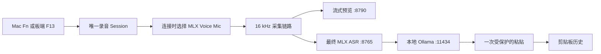

# inVoice

中文 · [English](README.en.md)

<p align="center">
  
</p>

<p align="center">
  <strong>按住。说话。松开。继续创作。</strong><br>
  面向 Mac 任意输入框的本地、私密语音输入。
</p>

<p align="center">
  <a href="https://github.com/xiaokhkh/inVoice/releases/latest">下载</a> ·
  <a href="#快速开始">快速开始</a> ·
  <a href="README.en.md">English</a>
</p>

<p align="center">
  
  
  
  <a href="LICENSE"></a>
</p>

[](docs/assets/invoice-usage-demo.mp4)

**单屏使用演示：** `Fn` 语音输入（最终 **GLM-ASR 识别 + LLM 润色**）、
可搜索剪贴板历史，以及 `Command + Option + T` 极简助手。
[观看 MP4](docs/assets/invoice-usage-demo.mp4)。

inVoice 是一款本地优先的 macOS 菜单栏语音工具，用于语音输入、翻译和
写作辅助。按住 Mac 的 `Fn`，自然说话，松开后最终文字只会插入一次到
你原来使用的应用。不购买开发板也能完整使用。

如果想要更有手感的桌面工作流，可选接入圆形 Waveshare ESP32-S3 收音器，
用屏幕作为实体按住说话按钮；它只是增强项，不会改变 Mac 单机工作流。

语音识别和可选改写均在 Apple Silicon Mac 本机运行，使用 MLX、
sherpa-onnx 和 Ollama。只有安装依赖和下载模型时需要联网。

> 默认提示词会把中文语音整理成自然英文。语音、翻译和行动摘要提示词都可在
> inVoice Settings 中修改。

## 为什么选择 inVoice

- **直接在原应用输入。** ChatGPT、Codex、邮件、备忘录、浏览器、编辑器和聊天框都能用，
  不需要在窗口之间来回复制。
- **配置后数据不出 Mac。** 音频、转写、改写和剪贴板历史均留在本机，服务只监听回环地址。
- **投递位置更安全。** 只有开始录音的原应用仍在前台时才粘贴；否则保留在剪贴板，
  避免文字误入其他窗口。
- **不只是听写。** 同一个菜单栏应用还提供剪贴板搜索、极简本地对话和选中英文默认翻译。
- **硬件完全可选。** 先用 Mac 键盘开始，只有在需要实体控制面时再添加 ESP32-S3 收音器。

## 项目一览

| 项目 | 默认行为 |
| --- | --- |
| 触发方式 | 按住 Mac `Fn`、开发板屏幕或开发板 PWR |
| 麦克风源 | 连接时优先 `MLX Voice Mic`，断开后使用当前 macOS 输入 |
| 语音识别 | sherpa-onnx 低延迟预览 + GLM-ASR MLX 最终识别 |
| 文本处理 | 可选本地 Ollama 改写；不可用时回退到原始识别文本 |
| 文本投递 | 每次录音只粘贴一次；焦点变化时降级为仅复制 |
| 隐私 | 首次配置完成后，音频、文字、剪贴板历史和推理都留在 Mac 本机 |

## 日常操作

| 操作 | Mac | ESP32-S3 开发板 | 结果 |
| --- | --- | --- | --- |
| 语音输入 | 按住 `Fn`，说完松开 | 按住屏幕或 PWR，说完松开 | 实时预览、最终识别、可选改写并插入一次 |
| 剪贴板历史 | `Command + Fn` | 按一下 BOOT | 切换可搜索的剪贴板面板 |
| 提交当前输入 | 按 `Return` | 短按屏幕 | 向当前前台应用发送一次标准 Return |
| 本地助手 | `Command + Option + T` | — | 打开极简本地对话框；若已选中英文，则默认翻译为简体中文 |
| 设置 | `Command + Option + P` | — | 打开权限、模型和提示词设置 |

开发板连接时，每个新录音 Session 都会优先选择它的 USB 麦克风；拔掉后，
下一次录音自动回退到当前 macOS 输入。板端 F13/F14 只接受指定 USB
VID/PID 的 HID 报告，因此扩展坞或其他键盘不会制造第二份录音。

## 支持的收音器硬件


仓库内固件面向 **Waveshare ESP32-S3-Touch-AMOLED-1.75** 标准版，
型号 **SKU 31261**。这是初代 1.75 英寸开发板，不是后续的 `1.75C`。

| 部件 | 具体型号 / 规格 | 在 inVoice 中的用途 |
| --- | --- | --- |
| 开发板 | `ESP32-S3-Touch-AMOLED-1.75`，SKU `31261` | 已实测的固件目标 |
| SoC | `ESP32-S3R8`，双核 LX7，最高 240 MHz | USB Audio、HID、OTA、UI 和音频采集 |
| 内存 | 8 MB PSRAM + 外置 16 MB Flash | 双 OTA 槽和保留的 Jam 资源 |
| AMOLED | 1.75 英寸、466×466、`CO5300`、QSPI | Jam 动画与整圈绿色音量环 |
| 触摸 | `CST9217`、I2C | 屏幕按住说话与短按 Return |
| 音频 ADC | `ES7210`、板载双麦克风 | 24 kHz、单声道、16-bit USB 音频流 |
| 电源 / I/O | `AXP2101` + `TCA9554` | PWR 输入、电源管理与 GPIO 扩展 |
| 传感器 | `QMI8658` IMU + `PCF85063` RTC | 板上自带，inVoice 当前不依赖 |

Waveshare 还列出了带壳版 `-B`（SKU `31262`）和 GPS 版 `-G`
（SKU `31264`）。它们是官方变体，但项目目前只对 SKU `31261` 做回归验证。
请勿把该固件刷入 `ESP32-S3-Touch-AMOLED-1.75C`。

以上型号与规格已根据
[Waveshare 官方文档](https://docs.waveshare.com/ESP32-S3-Touch-AMOLED-1.75)
和 [ESP32-S3 数据手册](https://www.espressif.com/sites/default/files/documentation/esp32-s3_datasheet_en.pdf)
交叉核对。

### 板端 UI 与 USB 接口

- 按住屏幕或 PWR，开发板发送私有 F13 按住说话状态。
- 松开后结束同一录音；自然人声永远不会自行触发 Session。
- 短按屏幕会直接向前台应用发送一次标准 USB HID Return；按住 250 ms 则进入
  语音输入，不依赖 inVoice 做应用适配，也不需要辅助功能权限。
- 仅按住期间，保留的 Jam 表情切换到 thinking，绿色音量环绕整块圆屏显示。
- 正常运行时按一下 BOOT，发送 F14 并切换剪贴板历史面板。
- 设备名为 `MLX Voice Mic`，同时提供 USB Audio、键盘 HID 和独立厂商
  HID 更新接口，VID/PID 为 `0x303A:0x4002`。
- 屏幕触摸采用 40 ms 去抖以识别快速点击；PWR 和 BOOT 仍保持 100 ms。
  周期性绝对 HID 状态和拔出强制松开用于保护扩展坞、休眠恢复和热插拔场景。

原小智固件的 Jam GIF 继续保存在 Flash `0x800000` 起始的 `assets` 分区；
新固件只读取这些资源，不替换它们。

## 语音链路



预览窗口不会抢走键盘焦点。inVoice 会在录音开始时记录前台应用；只有该应用
仍在前台时，才通过 private event source 发送一次 Cmd+V。若焦点已经变化或
事件投递不可用，最终文字会保留在剪贴板供手动恢复。

## 环境要求

- macOS 13 或更高版本
- Apple Silicon Mac
- Python 3.9 或更高版本
- [macOS 版 Ollama](https://ollama.com/download/mac)
- 首次安装时可访问互联网
- 仅从源码构建时需要 Xcode
- 可选硬件链路：Waveshare SKU `31261` 和支持数据传输的 USB Type-C 线

首次安装会下载数 GB 本地模型。默认安装在当前用户目录，不需要管理员密码。

## 快速开始

### 安装 Beta 版

1. 安装并打开 [Ollama](https://ollama.com/download/mac)，同时确认系统可以运行 `python3`。
2. 从 [GitHub 最新 Release](https://github.com/xiaokhkh/inVoice/releases/latest)
   下载 Apple Silicon DMG。
3. 打开 DMG，双击 **Install inVoice.command**。它会把 App 安装到
   `~/Applications`，并为当前用户下载本地模型。
4. 当 macOS 拦截当前临时签名的 Beta 版时，右键安装器选择 **打开**，
   再到 **系统设置 → 隐私与安全性** 中确认。

安装器是可直接审阅的 Shell 脚本，不会要求管理员密码；首次配置后，
音频推理仍然只在本机运行。

### 从源码构建

先安装并打开 Ollama，然后运行：

```bash
git clone https://github.com/xiaokhkh/inVoice.git
cd inVoice
./scripts/install.sh
```

源码安装器可以重复执行。它会准备两个 Python 环境、下载缺失的 ASR 模型、准备
默认 Ollama 模型、构建 Release App、安装到
`~/Applications/inVoice.app`、记录 sidecar 路径并启动 inVoice。

### 首次运行

1. 打开 **inVoice Settings** → **Permissions**。
2. 分别授予一次 **输入监控**、**辅助功能**和**麦克风**权限。
3. 回到 inVoice，点击 **Refresh Status**。
4. 确认权限与 Local Runtime 项目全部为绿色。
5. 聚焦任意文本框，按住 `Fn` 或开发板屏幕，说话后松开。

权限请求只由对应设置按钮或语音操作触发，inVoice 启动时不会重复弹窗。

## 安装和更新板端固件

使用 ESP-IDF 5.5.x 在固件目录构建：

```bash
cd firmware/esp32-s3-touch-amoled-1.75
idf.py set-target esp32s3
idf.py build
```

首次安装需要写入新的双槽分区表，因此只在这一次使用同一根 Type-C 线进入
ESP32-S3 ROM 下载模式：按住 BOOT 重新连接，ROM 设备出现后松开，再运行：

```bash
idf.py -p /dev/cu.usbmodemXXXX flash
```

不要运行 `erase-flash`：Jam assets 占用 `0x800000-0xFFFFFF`，必须保留。

首次安装完成后，开发板正常运行时直接更新，不再按键，不需要 Wi-Fi 或五线下载器：

```bash
./scripts/update_esp32_firmware.sh
```

更新器会验证 ESP 镜像和 CRC，通过现有 Type-C 连接写入非活动 OTA 槽，原子切换
启动槽并重启开发板。

恢复、分区和集成细节见[固件说明](firmware/esp32-s3-touch-amoled-1.75/README.md)、
[USB OTA 协议](docs/ESP32_USB_OTA_PROTOCOL.md)和
[中文硬件交接](docs/ESP32_S3_TOUCH_AMOLED_1_75_ZH.md)。

## 诊断

安装或识别异常时运行只读诊断：

```bash
./scripts/doctor.sh
```

| 现象 | 检查或处理 |
| --- | --- |
| 按住 `Fn` 没反应 | 打开输入监控权限；测试时避开密码输入框 |
| 按开发板没有进入输入 | 确认系统中存在 `MLX Voice Mic`，并授予输入监控权限 |
| 开发板一直处于输入状态 | 重新插拔并确认使用当前固件；拔出设备应强制松开 |
| 已识别但没有插入文字 | 打开辅助功能权限，并保持原目标应用在前台；否则从剪贴板恢复 |
| 没有选择板载麦克风 | 确认 USB Audio 名称为 `MLX Voice Mic`；新 Session 会自动选择 |
| 缺少模型或 Python 环境 | 重新运行 `./scripts/install.sh` |
| Ollama 不可用 | 打开 Ollama，再运行 `ollama pull qwen2.5-coder:7b-instruct-q5_1` |

运行日志位于 `~/Library/Logs/VoiceOps/`。

### 安装器选项

```text
./scripts/install.sh [options]

--skip-models       保留已有 ASR 模型并跳过下载
--skip-ollama       跳过 Ollama 检查和模型拉取
--no-launch         安装后不打开 inVoice
--install-dir PATH  安装到 ~/Applications 以外的位置
--python PATH       使用指定的 Python 3.9+ 可执行文件
```

### 环境变量

| 变量 | 默认值 | 用途 |
| --- | --- | --- |
| `VOICEOPS_INSTALL_DIR` | `~/Applications` | 当前用户的 App 安装目录 |
| `VOICEOPS_SETUP_PYTHON` | `python3` | 创建 sidecar 环境所用的 Python |
| `VOICEOPS_OLLAMA_MODEL` | `qwen2.5-coder:7b-instruct-q5_1` | 安装器准备的 Ollama 模型 |
| `ASR_MODEL_ID` | `mlx-community/GLM-ASR-Nano-2512-8bit` | 最终 MLX ASR 模型 |
| `FAST_ASR_MODEL_DIR` | `models/zipformer` | 流式模型目录 |
| `FAST_ASR_SAMPLE_RATE` | `16000` | 流式 PCM 采样率 |
| `FAST_ASR_NUM_THREADS` | `4` | 流式解码线程数 |
| `VOICEOPS_SIDECAR_ROOT` | 自动发现 | 覆盖 App 使用的 sidecar 目录 |
| `VOICEOPS_PYTHON_PATH` | sidecar `.venv` | 覆盖 App 启动 sidecar 使用的 Python |

## 本地模型与数据

| 组件 | 默认模型或内容 | 本地位置 |
| --- | --- | --- |
| 流式 ASR | sherpa-onnx 中英双语 Zipformer | `models/zipformer/` |
| 最终 ASR | `mlx-community/GLM-ASR-Nano-2512-8bit` | Hugging Face 缓存 |
| 文本处理 | `qwen2.5-coder:7b-instruct-q5_1` | Ollama 模型目录 |
| 剪贴板历史 | 最近最多 200 项 | `~/Library/Application Support/mlx-voiceops/` |
| 运行日志 | Sidecar 标准输出与错误 | `~/Library/Logs/VoiceOps/` |

首次配置完成后，语音识别和 LLM 处理都通过只监听本机回环地址的服务完成。
提示词模板保存在 macOS user defaults，可在 inVoice Settings → LLM 中编辑。

## 开发

安装器也是准备开发环境最快的方式。完成后可手动启动 sidecar 并打开工程：

```bash
./scripts/dev_run.sh
open apps/macos/VoiceOps.xcodeproj
```

修改 `apps/macos/project.yml` 后重新生成 Xcode 工程：

```bash
cd apps/macos
xcodegen generate --spec project.yml
```

常用验证命令：

```bash
./scripts/doctor.sh
python3 -m py_compile sidecars/asr_mlx/server.py sidecars/fast_asr/server.py
xcodebuild -project apps/macos/VoiceOps.xcodeproj \
  -scheme VoiceOps -configuration Release build
```

人工回归清单见 [docs/TESTING.md](docs/TESTING.md)。

面向用户的产品名与 App 文件名已统一为 `inVoice`。Xcode target、bundle ID
以及内部 `VoiceOps` 支持/日志目录暂时保留原名，以便升级时继续沿用 macOS
权限和本地数据。

### 本地端点

| 服务 | 端口 | 端点 |
| --- | ---: | --- |
| 最终 ASR | `8765` | `GET /health` |
| 最终 ASR | `8765` | `POST /v1/asr/transcribe` |
| 流式 ASR | `8790` | `GET /health` |
| 流式 ASR | `8790` | `POST /v1/fast_asr/start` |
| 流式 ASR | `8790` | `POST /v1/fast_asr/push` |
| 流式 ASR | `8790` | `POST /v1/fast_asr/end` |
| Ollama | `11434` | `POST /api/chat` |

### 目录结构

```text
apps/macos/VoiceOps/                    SwiftUI 与 AppKit 应用
sidecars/asr_mlx/                       最终 GLM-ASR 服务
sidecars/fast_asr/                      流式 sherpa-onnx 服务
firmware/esp32-s3-touch-amoled-1.75/   USB 收音器与 OTA 固件
scripts/                                安装、诊断和更新工具
docs/                                   协议、交接、测试和图片资源
```

## 项目状态

inVoice 仍是活跃开发中的本地优先原型。Mac 与 ESP32-S3 的端到端链路
已经可用，包括扩展坞防抖、热插拔麦克风回退、一次性文字投递和后续免按键 OTA。
启动速度和识别效果仍会受到 Mac 性能、语言混合方式和本地模型选择影响。
